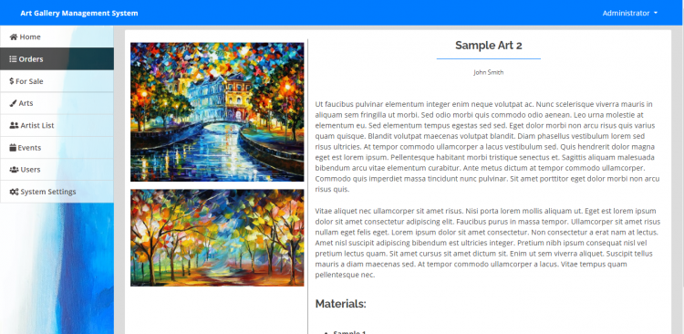

# Art Gallery Management System using PHP/MySQLi

### Description

The Art Gallery Management System with Simple CMS website using PHP/MySQL is a simple project that will help a certain gallery to manage their paintings or sculptures in their business. The main purpose of this project is to help the art gallery business market their arts online using their own website. This system includes upcoming events advertisement of an artist that rented the gallery to hep also their client, and this feature of the system may also use by the art gallery business to announce their own events.

### Features

<ul>
  <li><strong>Manage Arts List</strong></li>
  <li><strong>Manage Artist List</strong></li>
  <li><strong>Manage Events</strong></li>
  <li><strong>Manage Arts for Sale</strong></li>
  <li><strong>Manage Orders</strong></li>
  <li><strong>Manage Users</strong></li>
  <li><strong>Visitor's Page</strong></li>
</ul>

Visit [sourcecodester.com](https://www.sourcecodester.com/php/14503/art-gallery-management-system-using-phpmysql-source-code.html) for more details about this Project.

### Website Info

| Title | Art Gallery Management System using PHP/MySQL with Source Code |
|:--|:--|
| Website | [www.sourcecodester.com](https://www.sourcecodester.com) |
| Link | https://www.sourcecodester.com/php/14503/art-gallery-management-system-using-phpmysql-source-code.html |
| Language | PHP |
| Uploader/Developer | [oretnom23](https://www.sourcecodester.com/users/tips23) |
